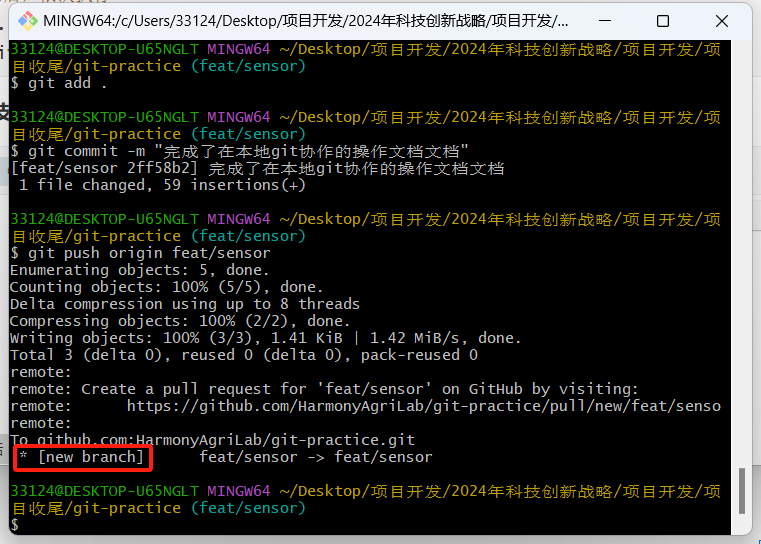
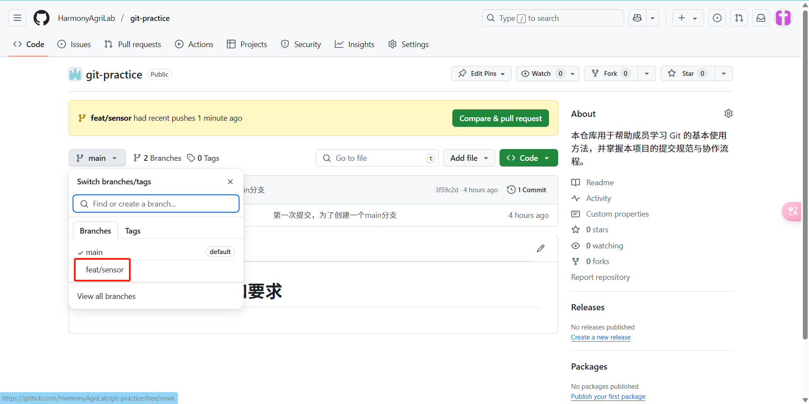
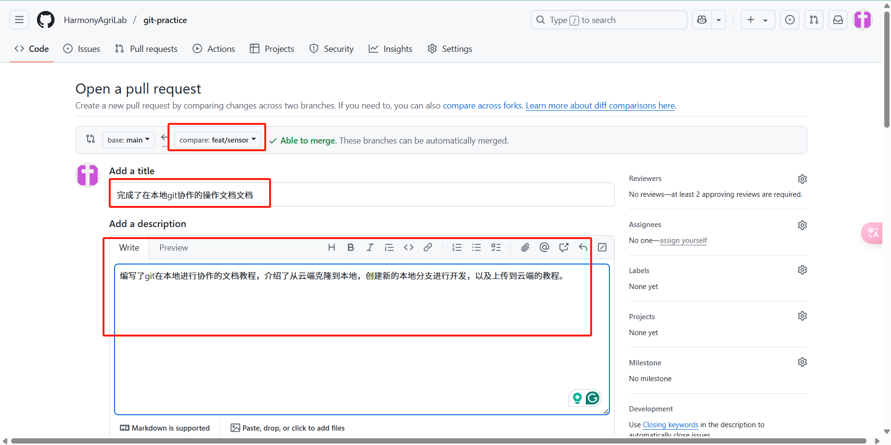

# 本项目git协作教程和要求

假设你已经配置好了github的ssh密钥，加入到了该项目的organization

## 1 git协作流程案例

### 1.1 仓库负责人要做的事情

**创建一个空的仓库**

在github网页上创建一个空的仓库，可以先在readme写一个标题，先创建出一个main分支。

**在设置添加保护分支**

首先需要在setting将仓库设置为public。然后Rules/Rulesets添加新的Ruleset。Ruleset Name叫“保护分支”；Enforcement status设置为Active；Branch targeting criteria选择Default；Branch rules勾上Restrict deletions、Require a pull request before merging（并且设置Required approvals为2）、Block force pushes；最后记得保存修改。

### 1.2 所有人都要复现做一遍的事情

**克隆该仓库**

只有第一次开发，本地还没有仓库才需要这个步骤

~~~sh
git clone git@github.com:HarmonyAgriLab/git-practice.git
~~~

**同步最新代码**

如果本地已经有了仓库，在创建自己的开发分支之前，需要确保同步了最新的代码

~~~sh
git checkout main					# 切换到main分支
git pull origin main				# 拉取最新的代码
~~~

**创建一个自己的分支**

分支名的命名无所谓，不要太离谱就好，比如叫develop，feat/sensor都行，这里以feat/sensor为例

~~~sh
git checkout -b feat/sensor
~~~

**在这个分支上提交自己的代码**

比如我在完善自己README.md的内容，你们可以创建一个自己名字的文件，随便写点内容，写完自己的代码之后，然后运行下面的命令，git commit的时候用中文描述自己的提交内容即可，注意引号是英文半角的引号哦

~~~sh
# 编辑代码后，依次执行
git add .
git commit -m "完成了在本地git协作的操作文档文档"
~~~

**将自己的分支推送到远程**

~~~sh
git push origin feat/sensor
~~~

---

接下来的操作需要在github仓库的网页完成

进入仓库主页，点分支按键，可以看到自己新建的分支和最新修改的代码

**发起 Pull Request / 合并请求**

在实际开发场景下，假设你的这个分支已经完成了某一个特性的开发，接下来可以先把这部分的代码合并到main分支上。进入Pull requests标签页，点击Compare & pull request，接下来确定是自己要合并的分支没有错，简单的写一下标题和本次合并的介绍就行了。确定无误之后点击Create pull request即可。之后的步骤将会交给仓库负责人审核，审核通过后由负责人合并到main主线上。分支被合并之后将会被删除，下一次开发时重复从**同步最新代码**开始即可。

云端的分支在被合并之后会被删除，但是本地的不会，使用下面命令可以删除指定分支，将下面的分支名改成自己的即可

~~~sh
git checkout main
git branch -d feat/sensor
~~~

